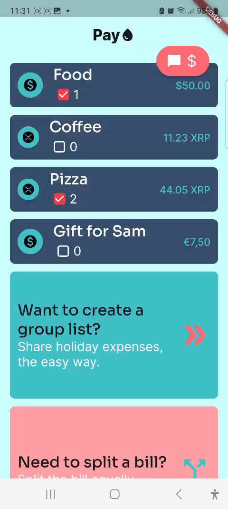

# Paydrop

## Overview
Welcome to Paydrop, your new international payment app! Paydrop leverages blockchain technology to make international payments easy, fast, and cheap. With Paydrop, you can send payment requests via WhatsApp or QR code, ensuring a seamless and efficient payment experience.

## Features
- **Easy Payment Requests:** Send payment requests through WhatsApp or generate a QR code.
- **Blockchain Technology:** Utilizes the XRP Ledger for secure and fast transactions.
- **International Payments:** Simplifies cross-border payments, reducing costs and time.
- **No Account Needed:** Users can pay without needing to create an account or deposit funds first.
- **Currency Flexibility:** Recipients can choose to receive money in any currency or in XRP, or a combination of both.
- **Additional Features:** Includes options for bill splitting and shared lists for managing group expenses.

## Demo

!

## Getting Started

### Prerequisites
- Node.js
- npm (Node Package Manager)
- flutter

### Installation
1. Clone the repository:
    ```bash
    git clone https://github.com/nialdixon8/PayDrop.git
    ```

3. Navigate to the project directory:
   ```bash
    cd PayDrop
    ```

4. Install the necessary dependencies:
    ```bash
    npm install
    ```

### Configuration
1. Create a `.env` file in the root directory and add your configuration variables:
    ```plaintext
    REACT_APP_RIPPLE_API_KEY=your_ripple_api_key
    REACT_APP_WHATSAPP_API_KEY=your_whatsapp_api_key
    ```
### Running the Application
1. flutter run

## License
Copyright (c) 2024, Paydrop.
All rights reserved.

## Contact
For any questions or feedback, please contact us at [dkramer@codam.student.nl] or [jguacide@codam.student.nl].

---

Thank you for using Paydrop! We hope it makes your international payments easier and more efficient.
